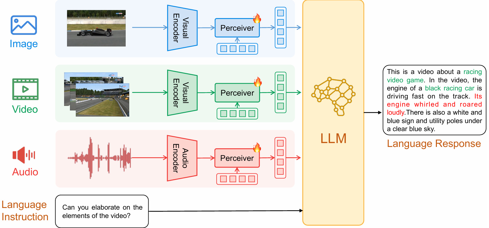

# Evaluation of MissRAG on ChatBridge
<p align="left">
        📑 <a href="https://arxiv.org/abs/2305.16103">Paper</a> 
</p>


 <figcaption><em>Model architecture of ChatBridge. It consists of multiple modal-specific encoders, perceiver modules and an LLM.</em></figcaption>
</figure>

## MissRAG+Prompt Engineering
Our MissRAG framework consists of a prototypes retrieval (PR) system, empowered with a modality-aware prompt engineering strategy (PE). Evaluate it on OneLLM by running the following scripts.

### Music AVQA: 
```bash
python avqa_eval_retrieval.py
  --cfg_path <PATH> \                     # Path to the checkpoint
  --data_path <PATH> \                    # Path to the test annotation file
  --root <PATH> \                         # Path to the audio/video files
  --modal video audio \                   # List of available modalities
  --task_modals video audio \             # List of task modalities
  --train_modality_tokens_path <PATH> \   # Path to the extracted modality tokens
  --test_IB_embeddings_path \             # Path to the extracted ImageBind test embeddings
  --train_IB_embeddings_path \            # Path to the extracted ImageBind train embeddings
  --k <K> \                               # Number of most similar prototypes to retrieve
  --answer_path <OUTPUT_PATH> \           # json file with the answers 
  --batch_size <BATCH_SIZE> \ 
  --prototype_prompt \                    # Flag to use PE technique 
  --prompt_template <PROMPT>              # Textual human prompt 
```

Test without PR by running the following script:
```bash
python avqa_eval.py
  --cfg_path <PATH> \                     # Path to the checkpoint
  --data_path <PATH> \                    # Path to the test annotation file
  --root <PATH> \                         # Path to the audio/video files
  --modal video audio                     # List of available modalities
  --answer_path <OUTPUT_PATH> \           # json file with the answers 
  --batch_size <BATCH_SIZE>  
  --missing_prompt True                   # Boolean to use PE technique 
  --prompt_template <PROMPT>              # Textual human prompt
```

### Valor: 
```bash
python valor_eval_retrieval.py
  --cfg_path <PATH> \                     # Path to the checkpoint
  --data_path <PATH> \                    # Path to the test annotation file
  --root <PATH> \                         # Path to the audio/video files
  --modal video audio \                   # List of available modalities
  --task_modals video audio \             # List of task modalities
  --train_modality_tokens_path <PATH> \   # Path to the extracted modality tokens
  --test_IB_embeddings_path \             # Path to the extracted ImageBind test embeddings
  --train_IB_embeddings_path \            # Path to the extracted ImageBind train embeddings
  --k <K>                                 # Number of most similar prototypes to retrieve
  --answer_path <OUTPUT_PATH> \           # json file with the answers 
  --batch_size <BATCH_SIZE> \ 
  --prototype_prompt \                    # Flag to use PE technique 
  --prompt_template <PROMPT>              # Textual human prompt 
```

Test without PR by running the following script:
```bash
python valor_eval.py
  --cfg_path <PATH> \                     # Path to the checkpoint
  --data_path <PATH> \                    # Path to the test annotation file
  --root <PATH> \                         # Path to the audio/video files
  --modal video audio \                   # List of available modalities
  --answer_path <OUTPUT_PATH> \           # json file with the answers 
  --batch_size <BATCH_SIZE> \  
  --missing_prompt True \                 # Boolean to use PE technique 
  --prompt_template <PROMPT>              # Textual human prompt 
```


### CharadesEGO: 
```bash
python charadesego_eval_retrieval.py
  --cfg_path <PATH> \                     # Path to the checkpoint
  --data_path <PATH> \                    # Path to the train annotation file
  --video_path <VIDEO_PATH> \             # Path to the video files
  --audio_path <AUDIO_PATH> \             # Path to the audio files    
  --modal video audio \                   # List of available modalities
  --task_modals video audio \             # List of task modalities
  --train_modality_tokens_path <PATH> \   # Path to the extracted modality tokens
  --test_IB_embeddings_path \             # Path to the extracted ImageBind test embeddings
  --train_IB_embeddings_path \            # Path to the extracted ImageBind train embeddings
  --k <K>                                 # Number of most similar prototypes to retrieve
  --answer_path <OUTPUT_PATH> \           # json file with the answers 
  --batch_size <BATCH_SIZE>  \
  --prototype_prompt \                    # Flag to use PE technique 
  --prompt_template <PROMPT>              # Textual human prompt 
```

Test without PR by running the following script:
```bash
python charadesego_eval.py
  --cfg_path <PATH> \                     # Path to the checkpoint
  --data_path <PATH> \                    # Path to the train annotation file
  --video_path <VIDEO_PATH> \             # Path to the video files
  --audio_path <AUDIO_PATH> \             # Path to the audio files    
  --modal video audio \                   # List of available modalities
  --task_modals video audio \             # List of task modalities
  --answer_path <OUTPUT_PATH> \           # json file with the answers 
  --batch_size <BATCH_SIZE> \ 
  --missing_prompt True   \               # Boolean to use PE technique 
  --prompt_template <PROMPT>              # Textual human prompt 
```

### MOSI
```bash
python MOSI_eval_retrieval.py
  --cfg_path <PATH> \                     # Path to the checkpoint
  --root <PATH> \                         # Path to the dataset
  --modal video audio \                   # List of available modalities
  --use_text_modality True \              # Boolean to use text modality
  --task_modals audio video \             # List of task modalities
  --train_modality_tokens_path <PATH> \   # Path to the extracted modality tokens
  --test_IB_embeddings_path \             # Path to the extracted ImageBind test embeddings
  --train_IB_embeddings_path \            # Path to the extracted ImageBind train embeddings
  --k <K>                                 # Number of most similar prototypes to retrieve
  --answer_path <OUTPUT_PATH> \           # json file with the answers 
  --batch_size <BATCH_SIZE> \  
  --prototype_prompt \                    # Flag to use PE technique 
  --prompt_template <PROMPT>              # Textual human prompt 
```

Test without PR by running the following script:
```bash
python MOSI_eval.py
  --cfg_path <PATH> \                     # Path to the checkpoint
  --root <PATH> \                         # Path to the audio/video files
  --modal video audio \                   # List of available modalities
  --task_modals video audio text \        # List of task modalities
  --use_text_modality True \              # Boolean to use text modality
  --answer_path <OUTPUT_PATH> \           # json file with the answers 
  --batch_size <BATCH_SIZE> \  
  --missing_prompt True \                 # Boolean to use PE technique 
  --prompt_template <PROMPT>              # Textual human prompt given to the model  
```

### MOSEI
```bash
python MOSEI_eval_retrieval.py
  --cfg_path <PATH> \                     # Path to the checkpoint
  --root <PATH> \                         # Path to the dataset
  --modal video audio \                   # List of available modalities
  --use_text_modality True \              # Boolean to use text modality
  --task_modals audio video \             # List of task modalities
  --train_modality_tokens_path <PATH> \   # Path to the extracted modality tokens
  --test_IB_embeddings_path \             # Path to the extracted ImageBind test embeddings
  --train_IB_embeddings_path \            # Path to the extracted ImageBind train embeddings
  --k <K>                                 # Number of most similar prototypes to retrieve
  --answer_path <OUTPUT_PATH> \           # json file with the answers 
  --batch_size <BATCH_SIZE> \  
  --prototype_prompt \                    # Flag to use PE technique 
  --prompt_template <PROMPT>              # Textual human prompt 
```

Test without PR by running the following script:
```bash
python MOSEI_eval.py
  --cfg_path <PATH> \                     # Path to the checkpoint
  --root <PATH> \                         # Path to the audio/video files
  --modal video audio \                   # List of available modalities
  --task_modals video audio text \        # List of task modalities
  --use_text_modality True \              # Boolean to use text modality
  --answer_path <OUTPUT_PATH> \           # json file with the answers 
  --batch_size <BATCH_SIZE> \  
  --missing_prompt True \                 # Boolean to use PE technique 
  --prompt_template <PROMPT>              # Textual human prompt given to the model  
```


## (Optional) Computing Modality Tokens
### Precompute the Modality Tokens of the Training Set
Create the modality tokens by running the following scripts which save them as `.h5` files inside the specified folder `answer_path/`.

#### Music AVQA:
```bash
python prototypes/collect_modality_tokens_music_avqa.py
  --cfg_path <PATH> \               # Path to the checkpoint
  --data_path <PATH> \              # Path to the train annotation file
  --root <PATH> \                   # Path to the audio/video files
  --answer_path <OUTPUT_PATH> \     # Directory for saving .pt files  
  --batch_size <BATCH_SIZE>  
```

#### Valor:
```bash
python prototypes/collect_modality_tokens_valor.py
  --cfg_path <PATH> \               # Path to the checkpoint
  --data_path <PATH> \              # Path to the train annotation file
  --root <PATH> \                   # Path to the audio/video files
  --answer_path <OUTPUT_PATH> \     # Directory for saving .pt files  
  --batch_size <BATCH_SIZE>  
```

#### CharadesEGO:
```bash
python prototypes/collect_modality_tokens_charadesego.py
  --cfg_path <PATH> \               # Path to the checkpoint
  --data_path <PATH> \               # Path to the train annotation file
  --video_path <VIDEO_PATH> \        # Path to the video files
  --audio_path <AUDIO_PATH> \        # Path to the audio files             
  --answer_path <OUTPUT_PATH> \      # Directory for saving .pt files  
  --batch_size <BATCH_SIZE>
```

#### MOSI:
```bash
python prototypes/collect_modality_tokens_MOSI.py
  --cfg_path <PATH> \               # Path to the checkpoint
  --data_path <PATH> \              # Path to the train annotation file
  --root <PATH> \                   # Path to the dataset
  --answer_path <OUTPUT_PATH> \     # Directory for saving .pt files  
  --batch_size <BATCH_SIZE>  
```

#### MOSEI:
```bash
python prototypes/collect_modality_tokens_MOSEI.py
  --cfg_path <PATH> \               # Path to the checkpoint
  --data_path <PATH> \              # Path to the train annotation file
  --root <PATH> \                   # Path to the dataset
  --answer_path <OUTPUT_PATH> \     # Directory for saving .pt files  
  --batch_size <BATCH_SIZE>  
```

### Create the `.h5` files
Create the `.h5` files of Music AVQA by running:
```bash
python prototypes/read_modality_tokens_music.py
```

Create the `.h5` files of Valor by running:
```bash
python prototypes/read_modality_tokens_valor.py
```

Create the `.h5` files of CharadesEGO by running:
```bash
python prototypes/read_modality_tokens_charadesego.py
```

Create the `.h5` files of MOSI by running:
```bash
python prototypes/read_modality_tokens_MOSI.py
```

Create the `.h5` files of MOSEI by running:
```bash
python prototypes/read_modality_tokens_MOSEI.py
```
