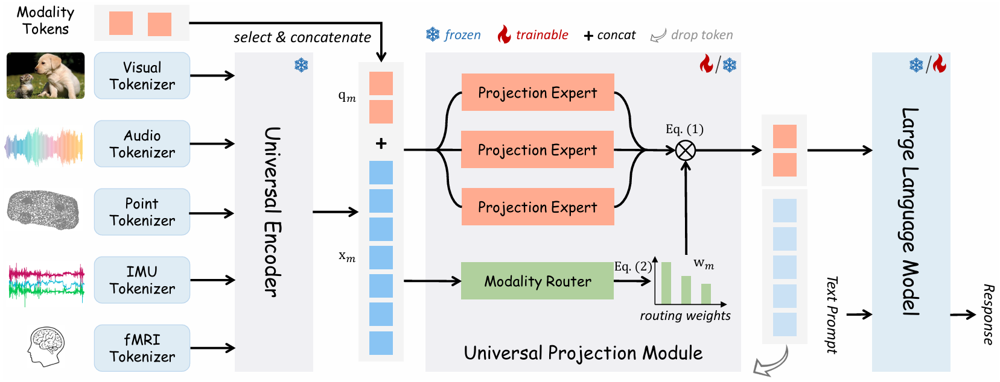

# Evaluation of MissRAG on OneLLM
<p align="left">
        📑 <a href="https://arxiv.org/abs/2312.03700">Paper</a> 
</p>


 <figcaption><em>The Architecture of OneLLM. OneLLM consists of modality tokenizers, a universal encoder, a universal projection module
 (UPM) and an LLM.</em></figcaption>
</figure>

## Precompute the Modality Tokens of the Training Set
Create the modality tokens by running the following scripts which save them as `.h5` files inside the specified folder `answer_path/`.

### Music AVQA:
```bash
python prototypes/collect_modality_tokens_music_avqa_SF.py
  --pretrained_path <PATH> \        # Path to the checkpoint
  --data_path <PATH> \              # Path to the train annotation file
  --root <PATH> \                   # Path to the audio/video files
  --answer_path <OUTPUT_PATH> \     # Directory for saving .pt files  
  --batch_size <BATCH_SIZE>  
```

### Valor:
```bash
python prototypes/collect_modality_tokens_valor_SF.py
  --pretrained_path <PATH> \        # Path to the checkpoint
  --data_path <PATH> \              # Path to the train annotation file
  --root <PATH> \                   # Path to the audio/video files
  --answer_path <OUTPUT_PATH> \     # Directory for saving .pt files  
  --batch_size <BATCH_SIZE>  
```

### CharadesEGO:
```bash
python prototypes/collect_modality_tokens_charadesego_SF.py
  --pretrained_path <PATH> \         # Path to the checkpoint
  --data_path <PATH> \               # Path to the train annotation file
  --video_path <VIDEO_PATH> \        # Path to the video files
  --audio_path <AUDIO_PATH> \        # Path to the audio files             
  --answer_path <OUTPUT_PATH> \      # Directory for saving .pt files  
  --batch_size <BATCH_SIZE>
```

### MOSI:
```bash
python prototypes/collect_modality_tokens_MOSI_SF.py
  --pretrained_path <PATH> \        # Path to the checkpoint
  --data_path <PATH> \              # Path to the train annotation file
  --root <PATH> \                   # Path to the dataset
  --answer_path <OUTPUT_PATH> \     # Directory for saving .pt files  
  --batch_size <BATCH_SIZE>  
```

### MOSEI:
```bash
python prototypes/collect_modality_tokens_MOSEI_SF.py
  --pretrained_path <PATH> \        # Path to the checkpoint
  --data_path <PATH> \              # Path to the train annotation file
  --root <PATH> \                   # Path to the dataset
  --answer_path <OUTPUT_PATH> \     # Directory for saving .pt files  
  --batch_size <BATCH_SIZE>  
```

## Create the `.h5` files
Create the `.h5` files of Music AVQA by running:
```bash
python prototypes/read_modality_tokens_music.py
```

Create the `.h5` files of Valor and CharadesEGO by running:
```bash
python prototypes/read_modality_tokens.py
```

Create the `.h5` files of MOSI and MOSEI by running:
```bash
python prototypes/read_modality_tokens_mosi.py
```
setting in the python files the correct dataset and the `data_dir` parameter which correspond to the `answer_path` previously used for the creation of the dataset modality tokens. 

## MissRAG+Prompt Engineering
Our MissRAG framework consists of a prototypes retrieval (PR) system, empowered with a modality-aware prompt engineering strategy (PE). Evaluate it on OneLLM by running the following scripts.

### Music AVQA: 
```bash
python audiovideo_qa_music_avqa_retrieval.py
  --pretrained_path <PATH> \              # Path to the checkpoint
  --data_path <PATH> \                    # Path to the test annotation file
  --root <PATH> \                         # Path to the audio/video files
  --modal video audio \                   # List of available modalities
  --task_modals video audio \             # List of task modalities
  --train_modality_tokens_path <PATH> \   # Path to the extracted modality tokens
  --test_IB_embeddings_path \             # Path to the extracted ImageBind test embeddings
  --train_IB_embeddings_path \            # Path to the extracted ImageBind train embeddings
  --k <K> \                               # Number of most similar prototypes to retrieve
  --answer_path <OUTPUT_PATH> \           # json file with the answers 
  --batch_size <BATCH_SIZE> \ 
  --prototipe_prompt \                    # Flag to use PE technique 
  --prompt_template <PROMPT>              # Textual human prompt 
```

Test without PR by running the following script:
```bash
python audiovideo_qa_music_avqa.py
  --pretrained_path <PATH> \              # Path to the checkpoint
  --data_path <PATH> \                    # Path to the test annotation file
  --root <PATH> \                         # Path to the audio/video files
  --modal video audio                     # List of available modalities
  --task_modals video audio               # List of task modalities
  --answer_path <OUTPUT_PATH> \           # json file with the answers 
  --batch_size <BATCH_SIZE>  
  --missing_prompt True                   # Boolean to use PE technique 
  --prompt_template <PROMPT>              # Textual human prompt
```

### Valor: 
```bash
python audiovideo_cap_valor32k_retrieval.py
  --pretrained_path <PATH> \              # Path to the checkpoint
  --data_path <PATH> \                    # Path to the test annotation file
  --root <PATH> \                         # Path to the audio/video files
  --modal video audio \                   # List of available modalities
  --task_modals video audio \             # List of task modalities
  --train_modality_tokens_path <PATH> \   # Path to the extracted modality tokens
  --test_IB_embeddings_path \             # Path to the extracted ImageBind test embeddings
  --train_IB_embeddings_path \            # Path to the extracted ImageBind train embeddings
  --k <K>                                 # Number of most similar prototypes to retrieve
  --answer_path <OUTPUT_PATH> \           # json file with the answers 
  --batch_size <BATCH_SIZE> \ 
  --prototipe_prompt \                    # Flag to use PE technique 
  --prompt_template <PROMPT>              # Textual human prompt 
```

Test without PR by running the following script:
```bash
python audiovideo_cap_valor32k.py
  --pretrained_path <PATH> \              # Path to the checkpoint
  --data_path <PATH> \                    # Path to the test annotation file
  --root <PATH> \                         # Path to the audio/video files
  --modal video audio \                   # List of available modalities
  --task_modals video audio \             # List of task modalities
  --answer_path <OUTPUT_PATH> \           # json file with the answers 
  --batch_size <BATCH_SIZE> \  
  --missing_prompt True \                 # Boolean to use PE technique 
  --prompt_template <PROMPT>              # Textual human prompt 
```


### CharadesEGO: 
```bash
python audiovideo_cap_charadesego_retrieval.py
  --pretrained_path <PATH> \              # Path to the checkpoint
  --data_path <PATH> \                    # Path to the train annotation file
  --video_path <VIDEO_PATH> \             # Path to the video files
  --audio_path <AUDIO_PATH> \             # Path to the audio files    
  --modal video audio \                   # List of available modalities
  --task_modals video audio \             # List of task modalities
  --train_modality_tokens_path <PATH> \   # Path to the extracted modality tokens
  --test_IB_embeddings_path \             # Path to the extracted ImageBind test embeddings
  --train_IB_embeddings_path \            # Path to the extracted ImageBind train embeddings
  --k <K>                                 # Number of most similar prototypes to retrieve
  --answer_path <OUTPUT_PATH> \           # json file with the answers 
  --batch_size <BATCH_SIZE>  \
  --prototipe_prompt \                    # Flag to use PE technique 
  --prompt_template <PROMPT>              # Textual human prompt 
```

Test without PR by running the following script:
```bash
python audiovideo_cap_charadesego.py
  --pretrained_path <PATH> \              # Path to the checkpoint
  --data_path <PATH> \                    # Path to the train annotation file
  --video_path <VIDEO_PATH> \             # Path to the video files
  --audio_path <AUDIO_PATH> \             # Path to the audio files    
  --modal video audio \                   # List of available modalities
  --task_modals video audio \             # List of task modalities
  --answer_path <OUTPUT_PATH> \           # json file with the answers 
  --batch_size <BATCH_SIZE> \ 
  --missing_prompt True   \               # Boolean to use PE technique 
  --prompt_template <PROMPT>              # Textual human prompt 
```

#### MOSI
```bash
python audiovideo_sentimentAnalysis_MOSI_retrieval.py
  --pretrained_path <PATH> \              # Path to the checkpoint
  --root <PATH> \                         # Path to the dataset
  --modal video audio \                   # List of available modalities
  --use_text_modality True \              # Boolean to use text modality
  --task_modals audio video \             # List of task modalities
  --train_modality_tokens_path <PATH> \   # Path to the extracted modality tokens
  --test_IB_embeddings_path \             # Path to the extracted ImageBind test embeddings
  --train_IB_embeddings_path \            # Path to the extracted ImageBind train embeddings
  --k <K>                                 # Number of most similar prototypes to retrieve
  --answer_path <OUTPUT_PATH> \           # json file with the answers 
  --batch_size <BATCH_SIZE> \  
  --prototipe_prompt \                    # Flag to use PE technique 
  --prompt_template <PROMPT>              # Textual human prompt 
```

Test without PR by running the following script:
```bash
python audiovideo_sentimentAnalysis_MOSI.py
  --pretrained_path <PATH> \              # Path to the checkpoint
  --root <PATH> \                         # Path to the audio/video files
  --modal video audio \                   # List of available modalities
  --task_modals video audio text \        # List of task modalities
  --use_text_modality True \              # Boolean to use text modality
  --answer_path <OUTPUT_PATH> \           # json file with the answers 
  --batch_size <BATCH_SIZE> \  
  --missing_prompt True \                 # Boolean to use PE technique 
  --prompt_template <PROMPT>              # Textual human prompt given to the model  
```

#### MOSEI
```bash
python audiovideo_sentimentAnalysis_MOSEI_retrieval.py
  --pretrained_path <PATH> \              # Path to the checkpoint
  --root <PATH> \                         # Path to the dataset
  --modal video audio \                   # List of available modalities
  --use_text_modality True \              # Boolean to use text modality
  --task_modals audio video \             # List of task modalities
  --train_modality_tokens_path <PATH> \   # Path to the extracted modality tokens
  --test_IB_embeddings_path \             # Path to the extracted ImageBind test embeddings
  --train_IB_embeddings_path \            # Path to the extracted ImageBind train embeddings
  --k <K>                                 # Number of most similar prototypes to retrieve
  --answer_path <OUTPUT_PATH> \           # json file with the answers 
  --batch_size <BATCH_SIZE> \  
  --prototipe_prompt \                    # Flag to use PE technique 
  --prompt_template <PROMPT>              # Textual human prompt 
```

Test without PR by running the following script:
```bash
python audiovideo_sentimentAnalysis_MOSEI.py
  --pretrained_path <PATH> \              # Path to the checkpoint
  --root <PATH> \                         # Path to the audio/video files
  --modal video audio \                   # List of available modalities
  --task_modals video audio text \        # List of task modalities
  --use_text_modality True \              # Boolean to use text modality
  --answer_path <OUTPUT_PATH> \           # json file with the answers 
  --batch_size <BATCH_SIZE> \  
  --missing_prompt True \                 # Boolean to use PE technique 
  --prompt_template <PROMPT>              # Textual human prompt given to the model  
```

## MissRAG is Not Sensible to the Task
Run the following scripts to test MissRAG with the prototype pool extended to the training sets of all datasets, to demonstrate our method is not restricted or sensitive to the tasks. Use the same arguments described before for the PE+PR evaluation and set the paths of the other datasets in the scripts.
 
```bash
python audiovideo_qa_music_avqa_retrieval_all_tokens.py
```

```bash
python audiovideo_cap_valor32k_retrieval_all_tokens.py
```

```bash
python audiovideo_cap_charadesego_retrieval_all_tokens.py
```

```bash
python audiovideo_sentimentAnalysis_MOSI_retrieval_all_tokens.py
```

```bash
python audiovideo_sentimentAnalysis_MOSEI_retrieval_all_tokens.py
```
