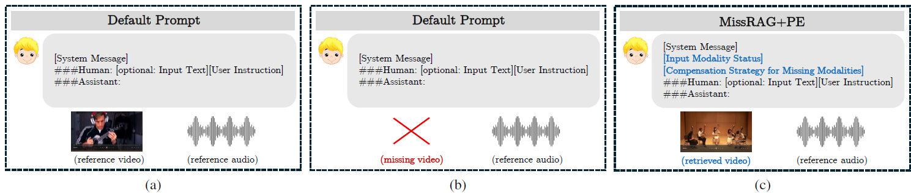
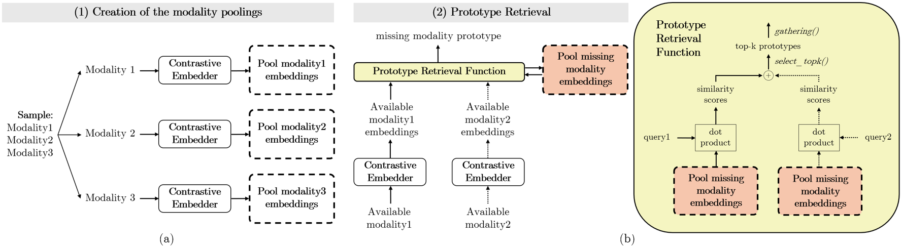

<p align="center">
    
<p>

<h3 align="center"><a href="https://iris.unimore.it/handle/11380/1381191" style="color:#D2691E">
MissRAG: Addressing the Missing Modality Challenge in Multimodal Large Language Models</a></h3>

We release **MissRAG**, a novel multimodal Retrieval-Augmented Generation (RAG) framework developed to address the missing modality problem in Multimodal Large Language Models (MLLMs). MissRAG is capable of simultaneously handling three modalities and supports retrieval across all possible combinations of single and multiple input modalities. Additionally, the framework integrates modality-aware textual prompts that explicitly indicate missing inputs, thereby conditioning and guiding the generation process more effectively.

This repository includes all materials necessary to reproduce our framework across five diverse datasets—Music AVQA for audio-visual question answering, Valor and CharadesEGO for audio-visual captioning, MOSI and MOSEI for multimodal sentiment analysis—on three publicly available models, namely [OneLLM](https://github.com/csuhan/OneLLM),
[VideoLLaMA 2](https://github.com/DAMO-NLP-SG/VideoLLaMA2/tree/audio_visual), and [ChatBridge](https://github.com/joez17/ChatBridge).

## 📑 Contents
- [Overview](#-overview)
  - [Introduction](#introduction)
  - [Key Features](#key-features)
  - [MissRAG Framework](#missrag-framework)
- [Models](#%EF%B8%8F-models)
- [Installation](#%EF%B8%8F-installation)
- [Datasets](#%EF%B8%8F-datasets)
- [Method](#-method)

## 📜 Overview 
### Introduction
In real-world scenarios, multimodal systems often face the challenge of handling cases where certain data modalities are missing or incomplete. Such issues may arise due to a range of factors, including sensor failures, hardware constraints, privacy restrictions, environmental noise, and data transmission errors. Collectively, these challenges are referred to in the literature as the missing modality problem.

MissRAG is the first multimodal Retrieval-Augmented Generation (RAG) framework that addresses the missing modality problem in MLLMs. It retrieves relevant modality data from a pool of training-set-derived prototypes when one or more inputs are absent by computing similarity scores between available and missing modalities, enabling the model to perform as if all modalities were present.

Additionally, our multimodal RAG framework is empowered with a modality-aware prompt engineering strategy that explicitly informs the model of missing inputs and guide the generation process accordingly.

### Key Features

* **First RAG framework to address the missing modality problem**: We propose a novel retrieval-augmented approach specifically designed for handling missing modalities in multimodal large language models (MLLMs).

* **Concurrently operates across three distinct modalities**: Our framework is capable of processing and retrieving audio, visual, and textual inputs in all possible single and multi-modal combinations.

* **Enhanced with the proposed prompt engineering strategy**: The multimodal RAG system utilizes modality-aware textual prompts to explicitly inform the model of missing inputs and guide generation accordingly.

* **Effectively mitigate the missing modality problem with MLLMs**: MissRAG effectively mitigates the missing modality problem for MLLMs across a wide range of tasks involving audio-video, and audio-video-text data. 

### MissRAG Framework

  <figcaption><em>Overview of three different scenarios: (a) complete modality scenario where both video and audio are available; (b) missing video scenario; (c) missing video scenario where our MissRAG+PE approach retrieves a prototype video while employing a designed textual prompt to mitigate the impact of the missing modality.</em></figcaption>
</figure>


 <figcaption><em>Overview of our MissRAG framework with three modalities. (a) Creation of modality embeddings through a contrastive embedder. (b) Retrieval of the top-k most similar prototypes by computing similarity scores between the embeddings of available modalities (i.e. query) and the stored embeddings of the missing modality via dot product, then aggregated to obtain the missing modality representation. Dashed arrows indicate that the second modality may be unavailable.</em></figcaption>
</figure>


## 🏛️ Models 
We evaluate MissRAG on three publicly available MLLMs capable of handling audio, video and text modalities: 
| Model    | Size    |  Download    |    
|----------|-------------|----------|
| OneLLM   | 7B  | [link](https://huggingface.co/csuhan/OneLLM-7B/)
| ChatBridge  | 13B  | [link](https://github.com/joez17/ChatBridge?tab=readme-ov-file)      
| VideoLLaMA 2  | 7B  | [link](https://huggingface.co/DAMO-NLP-SG/VideoLLaMA2.1-7B-AV)   

## 🛠️ Installation
Clone this repository into a local folder. 
```
git clone https://github.com/aimagelab/MissRAG.git
cd MissRAG
```
Create a python env for the specific MLLM model you want to evaluate and activate it. 
```bash
conda create -n onellm python=3.9 
conda activate onellm
cd OneLLM
pip install -r requirements.txt
```
```bash
conda create -n chatbridge python=3.9 
conda activate chatbridge
cd ChatBridge
pip install -r requirements.txt
```
```bash
conda create -n videollama2 python=3.9 
conda activate videollama2
cd VideoLLaMA2
pip install -r requirements.txt
```

## 🗂️ Datasets
| Task | Dataset    | Download    |
|---------------------------------------|-------------|-------------|
| Audio-visual question answering | Music AVQA    | [link](https://gewu-lab.github.io/MUSIC-AVQA/)  
| Audio-visual captioning | Valor  | [link](https://casia-iva-group.github.io/projects/VALOR/download.html) 
| Audio-visual captioning    | CharadesEGO | [link](https://prior.allenai.org/projects/charades-ego)
| Audio-video-text sentyment analysis | MOSI | [link](http://multicomp.cs.cmu.edu/resources/cmu-mosi-dataset/)
| Audio-video-text sentyment analysis | MOSEI | [link](http://multicomp.cs.cmu.edu/resources/cmu-mosei-dataset/)


## ⚙️ Method
### Creation of the Modality Poolings
Create the pool of training-set-derived prototypes with [ImageBind](https://github.com/facebookresearch/ImageBind) as contrastive embedder. Please refer to the [Evaluation Guide](docs/Prototype_Guide.md) for more details about how to create the prototypes.  

### Retrieval-Augmented Generation (RAG) system + Prompt Engineering 
#### - (if necessary) Precompute the Modality Tokens of the Training Sets
MissRAG retrieves the top-k most similar prototypes from the previously constructed pool, using the available modalities as queries. In OneLLM and ChatBridge, modality tokens for audio and video inputs have a fixed length; therefore, to avoid redundant computation of these tokens for retrieved prototypes, we precompute them for the entire training set and store them in .h5 files. In contrast, VideoLLaMA 2 produces audio and video representations of variable length, which necessitates computing them at run time. 

#### - Apply MissRAG to the MLLMs
To apply our MissRAG framework to OneLLM, ChatBridge and VideoLLaMA 2, please consult the respective README files for detailed instructions.
- [OneLLM](OneLLM/README.md)
- [ChatBridge](ChatBridge/README.md)
- [VideoLLaMA 2](VideoLLaMA2/README.md)

#### - Evaluate the answers
Refer to the `answer_mapping/` folder to evaluate the answers generated by the MLLMs. 
Specifically, run `answer_mapping/eval_music_avqa.py` script to evaluate Music AVQA predictions, `answer_mapping/caption_eval.py` to evaluate Valor and CharadesEGO captions and `answer_mapping/eval_MOSI_multiple_XOR.py`, `answer_mapping/eval_MOSEI_multiple_XOR.py`to evaluate MOSI and MOSEI predictions. Before running, set the path in the scripts to your result file.  

## 📚 References
* [ChatBridge: Bridging Modalities with Large Language Model as a Language Catalyst](https://github.com/joez17/ChatBridge)
* [OneLLM: One Framework to Align All Modalities with Language](https://github.com/csuhan/onellm)
* [VideoLLaMA 2: Advancing Spatial-Temporal Modeling and Audio Understanding in Video-LLMs](https://github.com/DAMO-NLP-SG/VideoLLaMA2/tree/audio_visual?tab=readme-ov-file)
* [ImageBind: One Embedding Space To Bind Them Al](https://github.com/facebookresearch/ImageBind)
* [Microsoft COCO Caption Evaluation](https://github.com/tylin/coco-caption)

## 🔗 Citing our work
If you find this code and paper useful for your research, please kindly cite our paper.
```
@inproceedings{2025ICCV_missrag,
	publisher={IEEE},
	venue={Honolulu, Hawaii},
	month={Oct},
	year={2025},
	pages={1--10},
	booktitle={International Conference on Computer Vision},
	title={{MISSRAG: Addressing the Missing Modality Challenge in Multimodal Large Language Models}},
	author={Pipoli, Vittorio and Saporita, Alessia and Bolelli, Federico and Cornia, Marcella and Baraldi, Lorenzo and Grana, Costantino and Cucchiara, Rita and Ficarra, Elisa},
}
```


