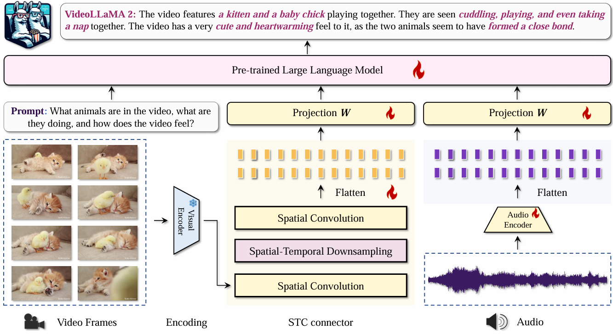

# Evaluation of MissRAG on VideoLLaMA 2
<p align="left">
        📑 <a href="https://arxiv.org/abs/2406.07476">Paper</a> 
</p>


 <figcaption><em>Model architecture of VideoLLaMA 2. </em></figcaption>
</figure>

## MissRAG
Our MissRAG framework consists of a prototypes retrieval (PR) system, empowered with a modality-aware prompt engineering strategy (PE). Evaluate it on OneLLM by running the following scripts.

### Music AVQA: 
```bash
python avqa_eval_retrieval.py
  --model_path <PATH> \                   # Path to the checkpoint
  --modal_type <MODAL_TYPE>               # Modality setting
  --data_path <PATH> \                    # Path to the test annotation file
  --root <PATH> \                         # Path to the audio/video files
  --modal video audio \                   # List of available modalities
  --task_modals video audio \             # List of task modalities
  --test_IB_embeddings_path \             # Path to the extracted ImageBind test embeddings
  --train_IB_embeddings_path \            # Path to the extracted ImageBind train embeddings
  --k <K> \                               # Number of most similar prototypes to retrieve
  --answer_path <OUTPUT_PATH> \           # json file with the answers 
  --batch_size <BATCH_SIZE> \ 
  --prototype_prompt \                    # Flag to use PE technique 
  --prompt_template <PROMPT>              # Textual human prompt 
```

Test the missing modality scenatios without PE+PR by running the following script:
```bash
python audiovideo_qa_music_avqa.py
  --model_path <PATH> \                   # Path to the checkpoint
  --modal_type <MODAL_TYPE>               # Modality setting
  --data_path <PATH> \                    # Path to the test annotation file
  --root <PATH> \                         # Path to the audio/video files
  --modal video audio                     # List of available modalities
  --task_modals video audio               # List of task modalities
  --answer_path <OUTPUT_PATH> \           # json file with the answers 
  --batch_size <BATCH_SIZE>  
  --prompt_template <PROMPT>              # Textual human prompt
```

### Valor: 
```bash
python audiovideo_cap_valor32k_retrieval.py
  --model_path <PATH> \                   # Path to the checkpoint
  --modal_type <MODAL_TYPE>               # Modality setting
  --data_path <PATH> \                    # Path to the test annotation file
  --root <PATH> \                         # Path to the audio/video files
  --modal video audio \                   # List of available modalities
  --task_modals video audio \             # List of task modalities
  --test_IB_embeddings_path \             # Path to the extracted ImageBind test embeddings
  --train_IB_embeddings_path \            # Path to the extracted ImageBind train embeddings
  --k <K>                                 # Number of most similar prototypes to retrieve
  --answer_path <OUTPUT_PATH> \           # json file with the answers 
  --batch_size <BATCH_SIZE> \ 
  --prototype_prompt \                    # Flag to use PE technique 
  --prompt_template <PROMPT>              # Textual human prompt 
```

Test the missing modality scenatios without PE+PR by running the following script:
```bash
python audiovideo_cap_valor32k.py
  --model_path <PATH> \                   # Path to the checkpoint
  --modal_type <MODAL_TYPE>               # Modality setting
  --data_path <PATH> \                    # Path to the test annotation file
  --root <PATH> \                         # Path to the audio/video files
  --modal video audio \                   # List of available modalities
  --task_modals video audio \             # List of task modalities
  --answer_path <OUTPUT_PATH> \           # json file with the answers 
  --batch_size <BATCH_SIZE> \   
  --prompt_template <PROMPT>              # Textual human prompt 
```


### CharadesEGO: 
```bash
python audiovideo_cap_charadesego_retrieval.py
  --model_path <PATH> \                   # Path to the checkpoint
  --modal_type <MODAL_TYPE>               # Modality setting
  --data_path <PATH> \                    # Path to the train annotation file
  --video_path <VIDEO_PATH> \             # Path to the video files
  --audio_path <AUDIO_PATH> \             # Path to the audio files    
  --modal video audio \                   # List of available modalities
  --task_modals video audio \             # List of task modalities
  --test_IB_embeddings_path \             # Path to the extracted ImageBind test embeddings
  --train_IB_embeddings_path \            # Path to the extracted ImageBind train embeddings
  --k <K>                                 # Number of most similar prototypes to retrieve
  --answer_path <OUTPUT_PATH> \           # json file with the answers 
  --batch_size <BATCH_SIZE>  \
  --prototype_prompt \                    # Flag to use PE technique 
  --prompt_template <PROMPT>              # Textual human prompt 
```

Test the missing modality scenatios without PE+PR by running the following script:
```bash
python audiovideo_cap_charadesego.py
  --model_path <PATH> \                   # Path to the checkpoint
  --modal_type <MODAL_TYPE>               # Modality setting
  --data_path <PATH> \                    # Path to the train annotation file
  --video_path <VIDEO_PATH> \             # Path to the video files
  --audio_path <AUDIO_PATH> \             # Path to the audio files    
  --modal video audio \                   # List of available modalities
  --task_modals video audio \             # List of task modalities
  --answer_path <OUTPUT_PATH> \           # json file with the answers 
  --batch_size <BATCH_SIZE> \ 
  --prompt_template <PROMPT>              # Textual human prompt 
```

#### MOSI
```bash
python audiovideo_sentimentAnalysis_MOSI_retrieval.py
  --model_path <PATH> \                   # Path to the checkpoint
  --modal_type <MODAL_TYPE>               # Modality setting
  --root <PATH> \                         # Path to the dataset
  --modal video audio \                   # List of available modalities
  --use_text_modality True \              # Boolean to use text modality
  --task_modals audio video \             # List of task modalities
  --test_IB_embeddings_path \             # Path to the extracted ImageBind test embeddings
  --train_IB_embeddings_path \            # Path to the extracted ImageBind train embeddings
  --k <K>                                 # Number of most similar prototypes to retrieve
  --answer_path <OUTPUT_PATH> \           # json file with the answers 
  --batch_size <BATCH_SIZE> \  
  --prototype_prompt \                    # Flag to use PE technique 
  --prompt_template <PROMPT>              # Textual human prompt 
```

Test the missing modality scenatios without PE+PR by running the following script:
```bash
python audiovideo_sentimentAnalysis_MOSI.py
  --model_path <PATH> \                   # Path to the checkpoint
  --modal_type <MODAL_TYPE>               # Modality setting
  --root <PATH> \                         # Path to the audio/video files
  --modal video audio \                   # List of available modalities
  --task_modals video audio text \        # List of task modalities
  --use_text_modality True \              # Boolean to use text modality
  --answer_path <OUTPUT_PATH> \           # json file with the answers 
  --batch_size <BATCH_SIZE> \  
  --prompt_template <PROMPT>              # Textual human prompt given to the model  
```

#### MOSEI
```bash
python audiovideo_sentimentAnalysis_MOSEI_retrieval.py
  --model_path <PATH> \                   # Path to the checkpoint
  --modal_type <MODAL_TYPE>               # Modality setting
  --root <PATH> \                         # Path to the dataset
  --modal video audio \                   # List of available modalities
  --use_text_modality True \              # Boolean to use text modality
  --task_modals audio video \             # List of task modalities
  --test_IB_embeddings_path \             # Path to the extracted ImageBind test embeddings
  --train_IB_embeddings_path \            # Path to the extracted ImageBind train embeddings
  --k <K>                                 # Number of most similar prototypes to retrieve
  --answer_path <OUTPUT_PATH> \           # json file with the answers 
  --batch_size <BATCH_SIZE> \  
  --prototype_prompt \                    # Flag to use PE technique 
  --prompt_template <PROMPT>              # Textual human prompt 
```

Test the missing modality scenatios without PE+PR by running the following script:
```bash
python audiovideo_sentimentAnalysis_MOSEI.py
  --model_path <PATH> \                   # Path to the checkpoint
  --modal_type <MODAL_TYPE>               # Modality setting
  --root <PATH> \                         # Path to the audio/video files
  --modal video audio \                   # List of available modalities
  --task_modals video audio text \        # List of task modalities
  --use_text_modality True \              # Boolean to use text modality
  --answer_path <OUTPUT_PATH> \           # json file with the answers 
  --batch_size <BATCH_SIZE> \   
  --prompt_template <PROMPT>              # Textual human prompt given to the model  
```
